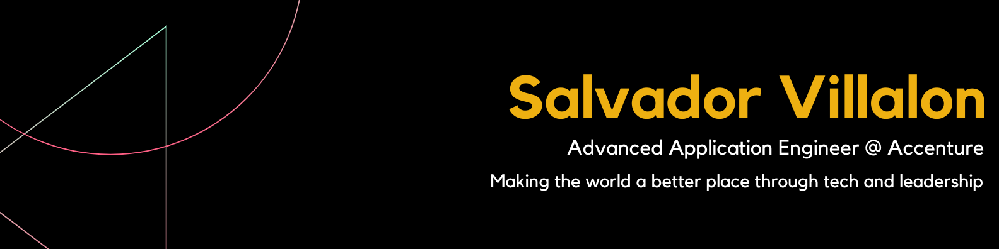

# Greetings! 

## 👨‍💻 About Me
My name is Salvador Villalon and I am a Software Engineer. I am from Calexico, CA 🔥. I am currently working at Accenture as an Advanced Application Engineering Analyst. 

## 🔭 Currently Working On
At Accenture, I am a Software Engineer who has worked for Code.org and currently creating innovative full-stack applications at a **Fortune 500 Social Media Company.** I am collaborating with a team of 3 off-shore engineers to deliver a new internal tool.

I am also working on developing my Personal Website Version 3!

## 💪🏽 Value I Bring
Qualifications include a Bachelor’s Degree in Computer Science from the University of California, Irvine, and Web Development certifications from Codecademy, freeCodeCamp, and the Odin Project. Also completed a Data Science foundation Bootcamp from the Netflix Pathways Data Science program.

I bring the following to every project:
 ✔️ Experience working on enterprise-level applications 
 ✔️ Dedication to teamwork and flexible collaboration
 ✔️ Resourceful team player
 ✔️ Passion for learning and applying new things!

 ## ⚙️ Techonologies
 - HTML/CSS     - GraphQL
 - JavaScript   - Relay
 - TypeScript   - Hack
 - React.js     - MongoDB
 - Gatsby.js    - REST APIs
 - Node.js      - Firebase
 - Express.js   - MySQL
 
 ## &#x1f4c8; GitHub Stats

## 📫 Contact
- salvadorvillalon54[@].gmail.com
- [LinkedIn](https://www.linkedin.com/in/salvadorvillalon/)
- [GitHub](https://github.com/salvillalon45)
- [Medium](https://medium.com/@salvav1)

<!--
**salvillalon45/salvillalon45** is a ✨ _special_ ✨ repository because its `README.md` (this file) appears on your GitHub profile.

Here are some ideas to get you started:
- 🌱 I’m currently learning ...
- 👯 I’m looking to collaborate on ...
- 🤔 I’m looking for help with ...
- 💬 Ask me about ...
- 😄 Pronouns: ...
- ⚡ Fun fact: ...
-->
